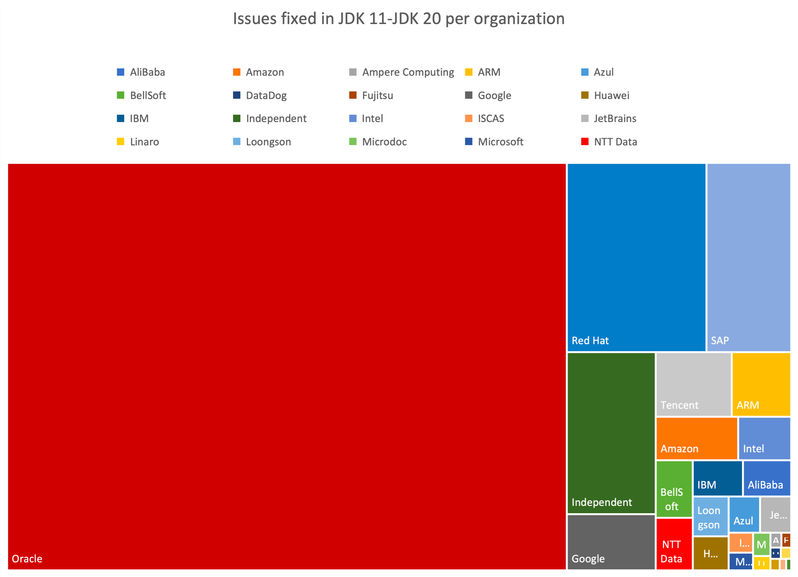

# JDK20 Features ☕️

## 1. Prepare ⚙️

Install Java 20 using `sdk`

```bash
sdk install java 20-open
sdk use java 20-open
```

Link to JDK20 features: https://openjdk.java.net/projects/jdk/20/




### In `Java 20`, of the `2,314` JIRA issues marked as fixed, `1,595` were completed by Oracle, while `719` were contributed by other members of the Java community.

## 2. JEPs list 📄

---
#### 🔗 Language Updates and Improvements

* ### JEP 432: Record Patterns (Second Preview)
* ### JEP 433: Pattern Matching for switch (Fourth Preview)

---
#### 🔗 Project Loom Preview/Incubator Features

* ### JEP 429: Scoped Values (Incubator)
* ### JEP 436: Virtual Threads (Second Preview)
* ### JEP 437: Structured Concurrency (Second Incubator)

---
#### 🔗 Project Panama Preview Features

* ### JEP 434: Foreign Function & Memory API (Second Preview)
* ### JEP 438: Vector API (Fifth Incubator)

---
